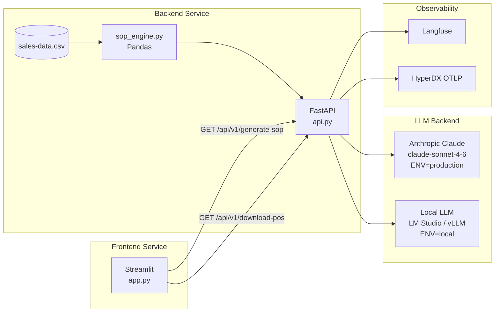

# Manukora S&OP Intelligence

[](https://github.com/chris-colinsky/manukora/actions/workflows/ci.yml)
[](https://github.com/chris-colinsky/manukora)
[](https://github.com/chris-colinsky/manukora)
[](https://python.org)

An AI-powered weekly S&OP briefing system for a DTC honey brand. A FastAPI backend runs all supply chain maths deterministically in Pandas, then passes verified data to Claude for executive narrative. A Streamlit frontend autoloads the briefing — no clicks required.

## Architecture



**Key architectural decision (ADR 0001):** All arithmetic is performed in Python/Pandas before the LLM is called. The LLM never sees raw CSV data — only a pre-computed JSON payload. This eliminates arithmetic hallucination risk. See [`_docs/adr/0001-calculate-first-reason-second.md`](_docs/adr/0001-calculate-first-reason-second.md).

## Local Development (uv)

```bash
# Backend
cd backend
uv sync --all-groups   # --all-groups installs dev dependencies (pytest, pytest-cov)
ENV=local uv run uvicorn api:app --reload
# → http://localhost:8000/docs

# Frontend (separate terminal)
cd frontend
uv sync --all-groups
BACKEND_URL=http://localhost:8000 uv run streamlit run app.py
# → http://localhost:8501
```

## Local Development (Docker Compose)

Assumes Langfuse (port 3000) and HyperDX (OTLP port 4318) are already running locally.

```bash
# Copy and configure environment
cp .env.example .env    # then fill in ANTHROPIC_API_KEY if using production mode

# Generate requirements.txt files and start all services
make reqs
make up
# Backend  → http://localhost:8000/docs
# Frontend → http://localhost:8501
```

## Running Tests

```bash
make test        # run both backend and frontend test suites with coverage
make lint        # black + ruff + mypy
make pre-commit  # install and run pre-commit hooks
```

Or run individual suites:

```bash
# Backend only
cd backend && uv run pytest tests/ --cov=. -v

# Frontend only
cd frontend && uv run pytest tests/ --cov=. -v

# Single test
cd backend && uv run pytest tests/test_sop_engine.py::test_bioactive_blend_projection_uses_m4_baseline -v
```

## API Endpoints

| Endpoint               | Method | Description                                                                    |
|------------------------|--------|--------------------------------------------------------------------------------|
| `/api/v1/generate-sop` | GET    | Run full S&OP pipeline; returns JSON with metrics, red flags, and LLM briefing |
| `/api/v1/download-pos` | GET    | Download draft Purchase Orders CSV (all SKUs with `Suggested_Reorder_Qty > 0`) |
| `/docs`                | GET    | Interactive Swagger UI                                                         |

### Sample Requests

```bash
# Generate S&OP briefing (returns JSON with metrics, red flags, and LLM narrative)
curl http://localhost:8000/api/v1/generate-sop

# Pretty-print the briefing JSON
curl -s http://localhost:8000/api/v1/generate-sop | python -m json.tool

# Extract just the LLM briefing text
curl -s http://localhost:8000/api/v1/generate-sop | python -c "import sys,json; print(json.load(sys.stdin)['llm_briefing'])"

# Download draft Purchase Orders as CSV
curl http://localhost:8000/api/v1/download-pos

# Save POs to a file
curl -o draft-purchase-orders.csv http://localhost:8000/api/v1/download-pos

# Health check via Swagger docs
curl -I http://localhost:8000/docs
```

## Environment Variables

Each service reads its own `.env` file from its own directory (`backend/.env` and `frontend/.env`). Neither file is committed — copy the root `.env.example` to get started:

```bash
cp .env.example backend/.env
cp .env.example frontend/.env
```

### Backend (`backend/.env`)

| Variable                      | Required        | Default                    | Description                                                                    |
|-------------------------------|-----------------|----------------------------|--------------------------------------------------------------------------------|
| `ENV`                         | Yes             | `local`                    | `local` uses OpenAI-compatible local LLM; `production` uses Anthropic          |
| `DATA_FILE_PATH`              | No              | `data/sales-data.csv`      | Path to the sales data CSV                                                     |
| `ANTHROPIC_API_KEY`           | Production only | —                          | Anthropic API key for Claude                                                   |
| `LOCAL_LLM_BASE_URL`          | Local only      | `http://localhost:1234/v1` | LM Studio or vLLM base URL                                                     |
| `LOCAL_LLM_MODEL`             | Local only      | `local-model`              | Model name for local inference                                                 |
| `HYPERDX_API_KEY`             | No              | —                          | HyperDX API key (used as `Authorization` header; omit for local self-hosted)   |
| `OTEL_EXPORTER_OTLP_ENDPOINT` | No              | —                          | OTLP endpoint — HyperDX OTLP ingestion port is `4318` (not the UI port `8080`) |
| `OTEL_SERVICE_NAME`           | No              | `honey-backend`            | Service name in traces                                                         |
| `LANGFUSE_PUBLIC_KEY`         | No              | —                          | Langfuse project public key                                                    |
| `LANGFUSE_SECRET_KEY`         | No              | —                          | Langfuse project secret key                                                    |
| `LANGFUSE_HOST`               | No              | `http://localhost:3000`    | Langfuse host URL                                                              |

### Frontend (`frontend/.env`)

| Variable      | Required | Default                 | Description          |
|---------------|----------|-------------------------|----------------------|
| `BACKEND_URL` | No       | `http://localhost:8000` | Backend API base URL |

## Deployment (Fly.io)

```bash
# Deploy backend
cd backend
fly launch --name honey-backend
fly secrets set ANTHROPIC_API_KEY=sk-ant-... ENV=production \
  LANGFUSE_PUBLIC_KEY=... LANGFUSE_SECRET_KEY=... LANGFUSE_HOST=...
fly deploy

# Deploy frontend
cd frontend
fly launch --name honey-frontend
fly secrets set BACKEND_URL=https://honey-backend.fly.dev
fly deploy
```

## Project Structure

```
honey/
├── .env.example                # Template — copy to backend/.env and frontend/.env
├── backend/                    # FastAPI microservice
│   ├── .env                    # ← NOT committed; copy from root .env.example
│   ├── data/sales-data.csv     # Bundled mock data (12 SKUs)
│   ├── tests/
│   │   ├── test_sop_engine.py  # 23 unit tests for all supply chain formulas
│   │   ├── test_api.py         # FastAPI endpoint integration tests
│   │   └── test_evals.py       # deepeval LLM reasoning validation
│   ├── api.py                  # FastAPI routes
│   ├── config.py               # Starlette Config — reads backend/.env
│   ├── schemas.py              # Pydantic models
│   ├── sop_engine.py           # Pandas calculation engine
│   ├── llm_service.py          # LLM factory + Tenacity + Langfuse
│   ├── telemetry.py            # Structlog + OpenTelemetry setup
│   ├── pyproject.toml          # Backend dependencies (uv)
│   └── Dockerfile
├── frontend/                   # Streamlit microservice
│   ├── .env                    # ← NOT committed; copy from root .env.example
│   ├── tests/test_app.py       # Streamlit AppTest suite
│   ├── app.py                  # Streamlit dashboard
│   ├── pyproject.toml          # Frontend dependencies (uv)
│   └── Dockerfile
├── _docs/
│   ├── adr/0001-calculate-first-reason-second.md
│   └── architecture.mmd
├── _reqs/submission-strategy-part-1.md
├── _plans/submission-strategy-part-1-plan.md
├── Makefile
├── docker-compose.yml
└── .github/workflows/ci.yml
```
