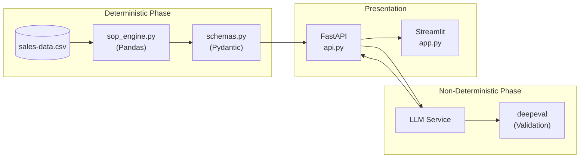
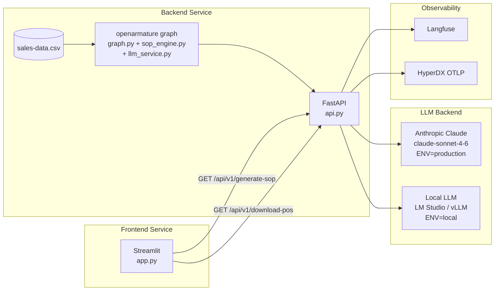
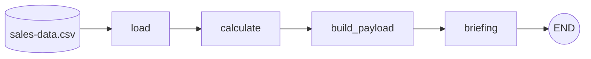
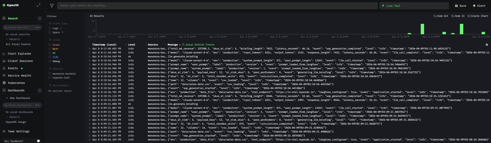
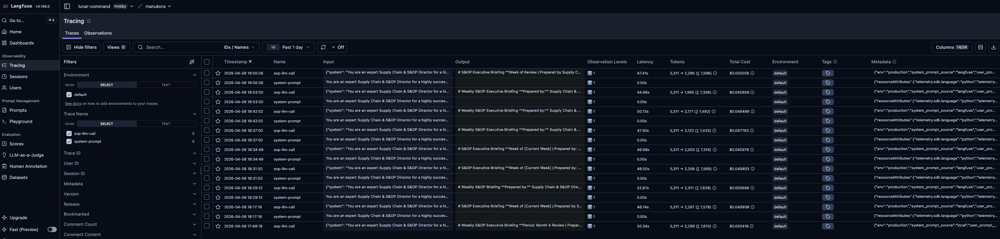

# Calculate First, Reason Second

[](https://github.com/chris-colinsky/deterministic-ai-agent-pattern/actions/workflows/ci.yml)
[](https://python.org)

A reference architecture for building deterministic AI agents. LLMs are reasoning engines, not calculators — so do all the math first, then let the LLM do what it's best at: turning verified data into narrative.

> *"Terravita" is a fictitious DTC wellness brand used throughout this project for demonstration purposes.*

## The Problem

Feeding raw CSVs to an LLM and asking it to "analyze the data" results in:
- **Arithmetic hallucinations** — the model invents numbers that look plausible but are wrong
- **Broken JSON** — structured output that fails downstream parsing
- **Catastrophic business decisions** — like recommending 400 units of dead stock for reorder

These failures aren't edge cases. They're the default behavior when you use a reasoning engine as a calculator.

## The Solution: Calculate First, Reason Second

Split the pipeline into two distinct phases:

1. **Deterministic Math (Pandas)** — All supply chain calculations (growth rates, stock cover, reorder quantities) are computed in Python with Pandas. Every formula is unit-tested. The output is a verified JSON payload.
2. **Non-Deterministic Reasoning (LLM)** — The LLM receives only the pre-computed payload. It writes the executive narrative, makes strategic recommendations, and identifies the air freight candidate — all grounded in verified numbers.

The LLM never sees raw CSV data. It reasons over facts, not files.



## Key Features

### CI/CD for LLMs (deepeval)

How do you test that an LLM is reasoning correctly? You compare its output against deterministic ground truth.

The air freight candidate (the at-risk SKU with the highest revenue) is computed by Pandas but **intentionally withheld** from the LLM's input payload. The LLM must identify it independently from the data. deepeval then grades the LLM's pick against the Pandas answer — using Claude Opus as the judge.

| Metric                  | What it proves                                                                  |
|-------------------------|---------------------------------------------------------------------------------|
| Air Freight Correctness | LLM identifies the right SKU from data, not a pre-supplied answer               |
| Briefing Completeness   | All required sections are present and properly structured                       |
| Faithfulness            | Every claim traces back to the pre-calculated payload — no hallucinated numbers |

### Zero-Hallucination Guardrails

The "Empty State Fallback" prompting technique prevents the LLM from inventing data when none exists. When no SKUs meet the dead stock criteria, the prompt uses explicit IF/ELSE branching:

> *IF the `poor_performers` list is EMPTY: Write "No SKUs currently meet our dead stock criteria." Then move on. Do NOT pick a SKU from elsewhere in the data. Do NOT invent a poor performer.*

Without this, smaller models will reliably hallucinate a poor performer to "fulfill" the prompt's expectation.

### Actionable Workflows

AI should drive action, not just chat. The "Download Draft POs" endpoint generates a CSV of purchase orders ready for upload to an inventory system — turning the LLM's strategic narrative into an executable business artifact.

## Built With AI Coding Tools

This project is also a demonstration of AI-assisted software development. Every phase — from requirements specification to deployment — was built using AI coding tools as a force multiplier.

### The Workflow

1. **Strategy & PRD** — Used Gemini Pro to draft the business strategy and product requirements document, translating a brief into a comprehensive technical spec.

2. **Requirements Specification** — Translated the PRD into a detailed technical requirements file ([`_reqs/calculate-first-reason-second.md`](_reqs/calculate-first-reason-second.md)) with explicit supply chain formulas, data schemas, API contracts, and acceptance criteria.

3. **Structured Planning with Claude Code** — Used a custom **`/feature-planning` skill** — a Claude Code slash command that enforces a 3-gate human-approval workflow before any code is written:
   - **Gate 1 (Clarify):** Claude reads the requirements file and appends clarifying questions directly into the file. Answers go in the file, then "answered" proceeds.
   - **Gate 2 (Plan):** Claude writes a full implementation plan. Only "approved" unlocks implementation.
   - **Gate 3 (Build):** Implementation proceeds phase-by-phase according to the approved plan.

4. **Iterative Development** — Built the Pandas calculation engine, FastAPI endpoints, LLM service (factory pattern for local/production), schemas, and telemetry iteratively with Claude Code.

5. **Prompt Hardening via Local LLM** — Tested against Mistral Small 3 (24B) running locally. Smaller models expose prompt weaknesses that larger models mask. Every failure became a prompt fix AND a new eval test.

6. **Frontend & Deployment** — Built the Streamlit dashboard, tested via Docker Compose, deployed to Fly.io — all pair-programmed with Claude Code.

## Table of Contents

- [Architecture](#architecture)
- [Local Development (uv)](#local-development-uv)
- [Local Development (Docker Compose)](#local-development-docker-compose)
- [Testing](#testing)
  - [Quick Start](#quick-start)
  - [Test Suites](#test-suites)
  - [Running Unit & API Tests](#running-unit--api-tests-no-llm-required)
  - [Running LLM Integration Tests](#running-llm-integration-tests)
  - [deepeval LLM Evaluation](#deepeval-llm-evaluation-claude-opus-as-judge)
  - [Evaluation Scorecard](#evaluation-scorecard)
  - [Local LLM Testing as a Prompt Hardening Strategy](#local-llm-testing-as-a-prompt-hardening-strategy)
- [Observability](#observability)
- [API Endpoints](#api-endpoints)
- [Environment Variables](#environment-variables)
- [Deployment (Fly.io)](#deployment-flyio)
- [Project Structure](#project-structure)

## Architecture



**Key architectural decision (ADR 0001):** All arithmetic is performed in Python/Pandas before the LLM is called. The LLM never sees raw CSV data — only a pre-computed JSON payload. This eliminates arithmetic hallucination risk. See [`_docs/adr/0001-calculate-first-reason-second.md`](_docs/adr/0001-calculate-first-reason-second.md).

### Pipeline topology

The backend's `/generate-sop` endpoint is orchestrated through an [openarmature](https://github.com/LunarCommand/openarmature-python) graph compiled once at application startup:



Each node is an async function that receives a typed `SOPState` and returns a partial update. The engine validates every merge against the state schema — a node returning a misspelled field name fails loudly with `StateValidationError` instead of silently dropping data. LLM concerns (prompt loading, retry, Langfuse tracing) live inside the `briefing` node; the graph itself is LLM-agnostic by design.

See [`_docs/openarmature-integration.md`](_docs/openarmature-integration.md) for a deeper walkthrough of the graph layer.

## Local Development (uv)

```bash
# Backend
cd backend
uv sync --all-groups   # --all-groups installs dev dependencies (pytest, pytest-cov)
ENV=local uv run uvicorn api:app --reload
# → http://localhost:8000/docs

# Frontend (separate terminal)
cd frontend
uv sync --all-groups
BACKEND_URL=http://localhost:8000 uv run streamlit run app.py
# → http://localhost:8501
```

## Local Development (Docker Compose)

Assumes Langfuse (port 3000) and HyperDX (OTLP port 4318) are already running locally.

```bash
# Copy and configure environment
cp .env.example .env    # then fill in ANTHROPIC_API_KEY if using production mode

# Generate requirements.txt files and start all services
make reqs
make up
# Backend  → http://localhost:8000/docs
# Frontend → http://localhost:8501
```

## Testing

### Quick Start

```bash
make test             # run both backend and frontend test suites with coverage
make test-integration # run live LLM integration tests (requires LLM running)
make test-eval        # run deepeval evaluation with rich output, saves to _docs/eval-results.txt
make lint             # black + ruff + mypy
make pre-commit       # install and run pre-commit hooks
```

### Test Suites

The project has three tiers of tests:

| Suite        | File                 | Tests                  | What it validates                                                                                                                    |
|--------------|----------------------|------------------------|--------------------------------------------------------------------------------------------------------------------------------------|
| **Unit**     | `test_sop_engine.py` | 23                     | Every supply chain formula, edge cases (division by zero, BioSynergy exception), reorder calculations                                |
| **API**      | `test_api.py`        | 10                     | FastAPI endpoints via TestClient, error handling, CSV download format                                                                |
| **LLM Eval** | `test_evals.py`      | 8 unit + 6 integration | Air freight extraction, ground truth validation, red flags integrity, BioSynergy exclusion, dead stock validity, MoM trend presence  |
| **deepeval** | `run_evals.py`       | 3 metrics              | Air freight correctness, briefing completeness, faithfulness (Claude Opus as judge)                                                  |

### Running Unit & API Tests (no LLM required)

```bash
cd backend && uv run pytest tests/ --cov=. -v
cd frontend && uv run pytest tests/ --cov=. -v
```

### Running LLM Integration Tests

These tests call a live LLM and are skipped by default (via `addopts = "-m 'not integration'"` in `pyproject.toml`).

**Against local LLM (LM Studio):**

```bash
make test-integration
```

**Against Anthropic API (production):**

```bash
ENV=production make test-integration
```

### deepeval LLM Evaluation (Claude Opus as Judge)

The standalone evaluation runner (`tests/run_evals.py`) uses [deepeval](https://github.com/confident-ai/deepeval) with **Claude Opus** as the LLM judge — a stronger model evaluating the output of Claude Sonnet. This follows the best practice of using a more capable model as the evaluator.

| Metric                  | Type               | What it proves                                                                                                               |
|-------------------------|--------------------|------------------------------------------------------------------------------------------------------------------------------|
| Air Freight Correctness | GEval              | The briefing's air freight recommendation identifies a top-revenue at-risk SKU with sound reasoning                          |
| Briefing Completeness   | GEval              | All 6 required sections are present (exec summary, sales performance, red flags, reorder recs, BioSynergy note, air freight) |
| Faithfulness            | FaithfulnessMetric | Every claim in the briefing traces back to the pre-calculated data payload — no hallucinated numbers                         |

The faithfulness metric is the core proof that the **"calculate first, reason second"** architecture works: the LLM reasons over verified data, not raw CSV.

**Run standalone evaluation with rich output:**

```bash
ENV=production make test-eval    # against Anthropic API → _docs/production-eval-results.txt
make test-eval                   # against local LLM    → _docs/local-eval-results.txt
```

All `make` targets run from the project root. Pass `ENV=production` on the command line to use the Anthropic API, or omit it to default to the local LLM (LM Studio). The output file is named by environment automatically.

This produces deepeval's full verbose output including evaluation steps, extracted claims/truths, judge reasoning, scores, and a summary table.

### Evaluation Scorecard

Results from running `make test-eval` against different LLM backends (scored by Claude Opus judge):

| Model               | Environment | Air Freight (0.7) | Completeness (0.7) | Faithfulness (0.7) | Result     |
|---------------------|-------------|-------------------|--------------------|--------------------|------------|
| Claude Sonnet 4.6   | production  | 0.8               | 1.0                | 1.0                | 3/3 passed |
| Mistral Small 3 24B | local       | 1.0               | 0.7                | 1.0                | 3/3 passed |
| Gemma 4 26B         | local       | 0.1               | 0.8                | 1.0                | 1/3 failed |

Thresholds shown in parentheses. Full results: [`_docs/production-eval-results.txt`](_docs/production-eval-results.txt) | [`_docs/local-eval-results.txt`](_docs/local-eval-results.txt)

### Local LLM Testing as a Prompt Hardening Strategy

We deliberately test against a smaller, open-weight model (Mistral Small 3 24B via LM Studio) during development. Smaller models are notoriously worse at following subtle prompt instructions than Claude Sonnet, which makes them ideal for exposing weak spots in prompt engineering. If a prompt works reliably on Mistral Small, it will be bulletproof on Claude.

This approach caught several critical issues that the deepeval metrics alone missed:

| Issue                                   | What happened                                                                                                      | How we caught it                                                               | Fix                                                                                                                              |
|-----------------------------------------|--------------------------------------------------------------------------------------------------------------------|--------------------------------------------------------------------------------|----------------------------------------------------------------------------------------------------------------------------------|
| **Hallucinated Red Flags**              | LLM flagged SKUs as "at risk" when their effective cover exceeded target                                           | Visual review of local output vs. Pandas ground truth table                    | Added `MUST ONLY select SKUs where Is_At_Risk == True` constraint; added `test_live_llm_red_flags_only_at_risk_skus` eval        |
| **BioSynergy as dead stock**            | LLM classified new Q1 2026 launch products as poor performers                                                      | Visual review — LLM ignored business context about new launches                | Added `FORBIDDEN` block excluding BioSynergy from dead stock section; added `test_live_llm_biosynergy_not_dead_stock` eval       |
| **Empty poor_performers hallucination** | When no SKUs met dead stock criteria (negative MoM + high cover), LLM invented one to fulfill the prompt's command | Local run produced zero valid poor performers, LLM picked a healthy SKU anyway | Restructured prompt with explicit IF/ELSE branching on empty list; added `test_live_llm_dead_stock_is_valid_poor_performer` eval |
| **Wrong air freight pick**              | LLM selected a lower-revenue at-risk SKU instead of the highest                                                    | Compared LLM output to Pandas `skus_at_risk` sorted by Revenue_M4              | Replaced prose instruction with algorithmic steps (sort → pick highest); existing air freight eval already covered this          |
| **Missing MoM trends**                  | Rubric requires trend data but LLM omitted growth percentages                                                      | Checked output against requirements                                            | Added per-SKU MoM requirement; added `test_live_llm_performers_include_mom_trend` eval                                           |
| **Reorder for healthy stock**           | Pandas recommended 414 units for a SKU with effective cover above target (not at risk)                             | Reviewed PO CSV download — contradicted dashboard's own risk assessment        | Fixed `sop_engine.py` to zero out `Suggested_Reorder_Qty` when `Is_At_Risk == False`                                             |

The pattern: run locally, compare LLM output against Pandas ground truth, identify the gap, harden the prompt AND add an eval to prevent regression. Each bug became a new integration test so it can never recur silently.

## Observability

The system has three layers of observability, each serving a different purpose:

### Structured Logging (Structlog)
All application logs are emitted as structured JSON via [Structlog](https://www.structlog.org/). Every log event includes timestamp, level, and contextual fields (e.g., `model`, `latency_seconds`, `input_tokens`). This makes logs machine-parseable and searchable — no regex required.

### Infrastructure Tracing (OpenTelemetry + HyperDX)
[OpenTelemetry](https://opentelemetry.io/) traces and logs are exported via OTLP/HTTP to [HyperDX](https://www.hyperdx.io/) for unified infrastructure observability. Traces cover the full request lifecycle — from API hit through Pandas calculation to LLM response. Configuration is environment-driven:
- **Local:** OTLP exports to self-hosted HyperDX on `localhost:4318`
- **Production:** OTLP exports to HyperDX cloud via `OTEL_EXPORTER_OTLP_ENDPOINT` and `OTEL_EXPORTER_OTLP_HEADERS` secrets


*Structured JSON logs from the production backend flowing into HyperDX cloud, showing LLM call events, token counts, and latency.*

### LLM Observability (Langfuse)
[Langfuse](https://langfuse.com/) wraps every LLM call with dedicated AI observability: prompt inputs, model outputs, latency, and token consumption. It also manages prompt versioning - prompts are stored as Jinja2 templates locally and published to Langfuse for A/B testing and version tracking.


*Production traces showing both system-prompt and sop-llm-call observations with token counts, latency, and cost per call.*

```bash
# Push prompt templates to Langfuse (local)
make push-prompt ARGS="-m 'description'"

# Push to cloud Langfuse
make push-prompt ARGS="--env-file .env.production -m 'description'"
```

Key design decision: OTEL and Langfuse are intentionally kept separate. Setting a global OTEL tracer provider would cause Langfuse to emit its LLM spans through OTEL, duplicating data. Instead, the app uses an explicit (non-global) tracer provider for infrastructure spans, keeping the two pipelines independent.

## API Endpoints

| Endpoint               | Method | Description                                                                    |
|------------------------|--------|--------------------------------------------------------------------------------|
| `/api/v1/generate-sop` | GET    | Run full S&OP pipeline; returns JSON with metrics, red flags, and LLM briefing |
| `/api/v1/download-pos` | GET    | Download draft Purchase Orders CSV (all SKUs with `Suggested_Reorder_Qty > 0`) |
| `/docs`                | GET    | Interactive Swagger UI                                                         |

### Sample Requests

```bash
# Generate S&OP briefing (returns JSON with metrics, red flags, and LLM narrative)
curl http://localhost:8000/api/v1/generate-sop

# Pretty-print the briefing JSON
curl -s http://localhost:8000/api/v1/generate-sop | python -m json.tool

# Extract just the LLM briefing text
curl -s http://localhost:8000/api/v1/generate-sop | python -c "import sys,json; print(json.load(sys.stdin)['llm_briefing'])"

# Download draft Purchase Orders as CSV
curl http://localhost:8000/api/v1/download-pos

# Save POs to a file
curl -o draft-purchase-orders.csv http://localhost:8000/api/v1/download-pos

# Health check via Swagger docs
curl -I http://localhost:8000/docs
```

## Environment Variables

Each service reads its own `.env` file from its own directory (`backend/.env` and `frontend/.env`). Neither file is committed — copy the root `.env.example` to get started:

```bash
cp .env.example backend/.env
cp .env.example frontend/.env
```

### Backend (`backend/.env`)

| Variable                      | Required        | Default                    | Description                                                                    |
|-------------------------------|-----------------|----------------------------|--------------------------------------------------------------------------------|
| `ENV`                         | Yes             | `local`                    | `local` uses OpenAI-compatible local LLM; `production` uses Anthropic          |
| `DATA_FILE_PATH`              | No              | `data/sales-data.csv`      | Path to the sales data CSV                                                     |
| `ANTHROPIC_API_KEY`           | Production only | —                          | Anthropic API key for Claude                                                   |
| `LOCAL_LLM_BASE_URL`          | Local only      | `http://localhost:1234/v1` | LM Studio or vLLM base URL                                                     |
| `LOCAL_LLM_MODEL`             | Local only      | `local-model`              | Model name for local inference                                                 |
| `OTEL_EXPORTER_OTLP_ENDPOINT` | No              | —                          | OTLP endpoint — HyperDX OTLP ingestion port is `4318` (not the UI port `8080`) |
| `OTEL_EXPORTER_OTLP_HEADERS`  | No              | —                          | OTLP auth headers (e.g., `authorization=Bearer <key>`; omit for local)         |
| `OTEL_SERVICE_NAME`           | No              | `cfrr-backend`             | Service name in traces                                                         |
| `LANGFUSE_PUBLIC_KEY`         | No              | —                          | Langfuse project public key                                                    |
| `LANGFUSE_SECRET_KEY`         | No              | —                          | Langfuse project secret key                                                    |
| `LANGFUSE_HOST`               | No              | `http://localhost:3000`    | Langfuse host URL                                                              |

### Frontend (`frontend/.env`)

| Variable      | Required | Default                 | Description          |
|---------------|----------|-------------------------|----------------------|
| `BACKEND_URL` | No       | `http://localhost:8000` | Backend API base URL |

## Deployment (Fly.io)

### Prerequisites

```bash
brew install flyctl
fly auth login
```

### 1. Generate requirements.txt files

Both Dockerfiles install from `requirements.txt`, so export them first:

```bash
make reqs
```

### 2. Deploy backend

```bash
cd backend
fly launch --name cfrr-backend
```

Set all production secrets (these are stored encrypted by Fly — never committed to the repo):

```bash
fly secrets set \
  ENV=production \
  ANTHROPIC_API_KEY=sk-ant-... \
  LANGFUSE_PUBLIC_KEY=pk-lf-... \
  LANGFUSE_SECRET_KEY=sk-lf-... \
  LANGFUSE_HOST=https://cloud.langfuse.com \
  OTEL_EXPORTER_OTLP_ENDPOINT=https://in-otel.hyperdx.io \
  OTEL_EXPORTER_OTLP_HEADERS="authorization=Bearer <HYPERDX_API_KEY>"
```

Deploy:

```bash
fly deploy
```

Verify: `https://cfrr-backend.fly.dev/docs`

### 3. Deploy frontend

```bash
cd frontend
fly launch --name cfrr-frontend
fly secrets set BACKEND_URL=https://cfrr-backend.fly.dev
fly deploy
```

Verify: `https://cfrr-frontend.fly.dev`

### 4. Push prompts to cloud Langfuse

Once the Langfuse cloud project is created and secrets are set locally in `backend/.env`:

```bash
make push-prompt ARGS="-m 'Initial production deployment'"
```

## Project Structure

```
deterministic-ai-agent-pattern/
├── .env.example                # Template — copy to backend/.env and frontend/.env
├── backend/                    # FastAPI microservice
│   ├── .env                    # ← NOT committed; copy from root .env.example
│   ├── data/sales-data.csv     # Bundled mock data (12 SKUs)
│   ├── tests/
│   │   ├── test_sop_engine.py  # 23 unit tests for all supply chain formulas
│   │   ├── test_api.py         # FastAPI endpoint integration tests
│   │   └── test_evals.py       # deepeval LLM reasoning validation
│   ├── api.py                  # FastAPI routes
│   ├── config.py               # Starlette Config — reads backend/.env
│   ├── schemas.py              # Pydantic models
│   ├── sop_engine.py           # Pandas calculation engine
│   ├── llm_service.py          # LLM factory + Tenacity + Langfuse
│   ├── telemetry.py            # Structlog + OpenTelemetry setup
│   ├── pyproject.toml          # Backend dependencies (uv)
│   └── Dockerfile
├── frontend/                   # Streamlit microservice
│   ├── .env                    # ← NOT committed; copy from root .env.example
│   ├── tests/test_app.py       # Streamlit AppTest suite
│   ├── app.py                  # Streamlit dashboard
│   ├── pyproject.toml          # Frontend dependencies (uv)
│   └── Dockerfile
├── _docs/
│   ├── adr/0001-calculate-first-reason-second.md
│   └── architecture.mmd
├── _reqs/calculate-first-reason-second.md
├── _plans/calculate-first-reason-second-plan.md
├── Makefile
├── docker-compose.yml
└── .github/workflows/ci.yml
```
