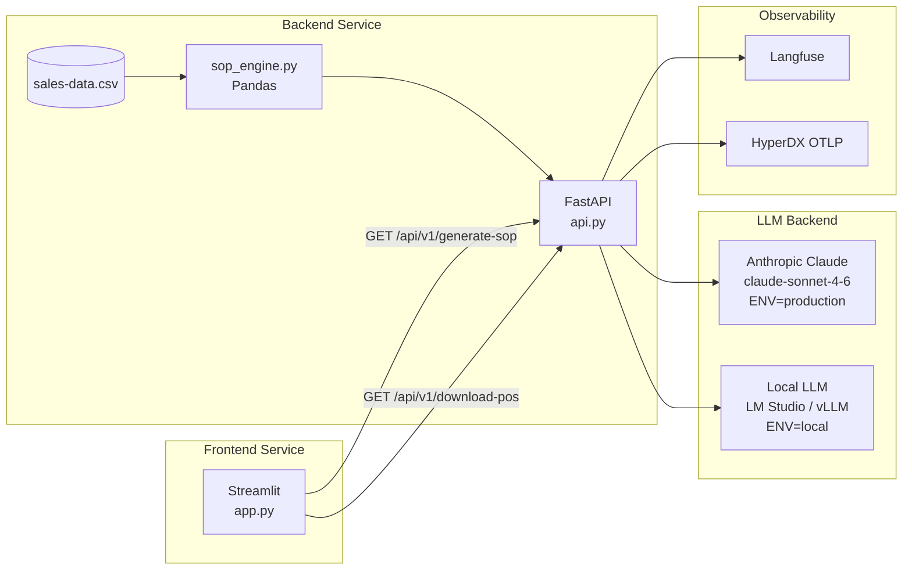

# Manukora S&OP Intelligence

[](https://github.com/chris-colinsky/manukora/actions/workflows/ci.yml)
[](https://github.com/chris-colinsky/manukora)
[](https://github.com/chris-colinsky/manukora)
[](https://python.org)

An AI-powered weekly S&OP briefing system for a DTC honey brand. A FastAPI backend runs all supply chain maths deterministically in Pandas, then passes verified data to Claude for executive narrative. A Streamlit frontend autoloads the briefing — no clicks required.

## Architecture



**Key architectural decision (ADR 0001):** All arithmetic is performed in Python/Pandas before the LLM is called. The LLM never sees raw CSV data — only a pre-computed JSON payload. This eliminates arithmetic hallucination risk. See [`_docs/adr/0001-calculate-first-reason-second.md`](_docs/adr/0001-calculate-first-reason-second.md).

## Local Development (uv)

```bash
# Backend
cd backend
uv sync --all-groups   # --all-groups installs dev dependencies (pytest, pytest-cov)
ENV=local uv run uvicorn api:app --reload
# → http://localhost:8000/docs

# Frontend (separate terminal)
cd frontend
uv sync --all-groups
BACKEND_URL=http://localhost:8000 uv run streamlit run app.py
# → http://localhost:8501
```

## Local Development (Docker Compose)

Assumes Langfuse (port 3000) and HyperDX (OTLP port 4318) are already running locally.

```bash
# Copy and configure environment
cp .env.example .env    # then fill in ANTHROPIC_API_KEY if using production mode

# Generate requirements.txt files and start all services
make reqs
make up
# Backend  → http://localhost:8000/docs
# Frontend → http://localhost:8501
```

## Testing

### Quick Start

```bash
make test             # run both backend and frontend test suites with coverage
make test-integration # run live LLM integration tests (requires LLM running)
make test-eval        # run deepeval evaluation with rich output, saves to _docs/eval-results.txt
make lint             # black + ruff + mypy
make pre-commit       # install and run pre-commit hooks
```

### Test Suites

The project has three tiers of tests:

| Suite        | File                 | Tests                  | What it validates                                                                                                                        |
|--------------|----------------------|------------------------|------------------------------------------------------------------------------------------------------------------------------------------|
| **Unit**     | `test_sop_engine.py` | 23                     | Every supply chain formula, edge cases (division by zero, Bioactive Blend exception), reorder calculations                               |
| **API**      | `test_api.py`        | 10                     | FastAPI endpoints via TestClient, error handling, CSV download format                                                                    |
| **LLM Eval** | `test_evals.py`      | 8 unit + 6 integration | Air freight extraction, ground truth validation, red flags integrity, Bioactive Blend exclusion, dead stock validity, MoM trend presence |
| **deepeval** | `run_evals.py`       | 3 metrics              | Air freight correctness, briefing completeness, faithfulness (Claude Opus as judge)                                                      |

### Running Unit & API Tests (no LLM required)

```bash
cd backend && uv run pytest tests/ --cov=. -v
cd frontend && uv run pytest tests/ --cov=. -v
```

### Running LLM Integration Tests

These tests call a live LLM and are skipped by default (via `addopts = "-m 'not integration'"` in `pyproject.toml`).

**Against local LLM (LM Studio):**

```bash
make test-integration
```

**Against Anthropic API (production):**

```bash
ENV=production make test-integration
```

### deepeval LLM Evaluation (Claude Opus as Judge)

The standalone evaluation runner (`tests/run_evals.py`) uses [deepeval](https://github.com/confident-ai/deepeval) with **Claude Opus** as the LLM judge — a stronger model evaluating the output of Claude Sonnet. This follows the best practice of using a more capable model as the evaluator.

| Metric                  | Type               | What it proves                                                                                                                    |
|-------------------------|--------------------|-----------------------------------------------------------------------------------------------------------------------------------|
| Air Freight Correctness | GEval              | The briefing's air freight recommendation identifies a top-revenue at-risk SKU with sound reasoning                               |
| Briefing Completeness   | GEval              | All 6 required sections are present (exec summary, sales performance, red flags, reorder recs, Bioactive Blend note, air freight) |
| Faithfulness            | FaithfulnessMetric | Every claim in the briefing traces back to the pre-calculated data payload — no hallucinated numbers                              |

The faithfulness metric is the core proof that the **"calculate first, reason second"** architecture works: the LLM reasons over verified data, not raw CSV.

**Run standalone evaluation with rich output:**

```bash
ENV=production make test-eval    # against Anthropic API → _docs/production-eval-results.txt
make test-eval                   # against local LLM    → _docs/local-eval-results.txt
```

All `make` targets run from the project root. Pass `ENV=production` on the command line to use the Anthropic API, or omit it to default to the local LLM (LM Studio). The output file is named by environment automatically.

This produces deepeval's full verbose output including evaluation steps, extracted claims/truths, judge reasoning, scores, and a summary table.

### Evaluation Scorecard

Results from running `make test-eval` against different LLM backends (scored by Claude Opus judge):

| Model               | Environment | Air Freight (0.7) | Completeness (0.7) | Faithfulness (0.7) | Result     |
|---------------------|-------------|-------------------|--------------------|--------------------|------------|
| Claude Sonnet 4.6   | production  | 0.8               | 1.0                | 1.0                | 3/3 passed |
| Mistral Small 3 24B | local       | 1.0               | 0.7                | 1.0                | 3/3 passed |
| Gemma 4 26B         | local       | 0.1               | 0.8                | 1.0                | 1/3 failed |

Thresholds shown in parentheses. Full results: [`_docs/production-eval-results.txt`](_docs/production-eval-results.txt) | [`_docs/local-eval-results.txt`](_docs/local-eval-results.txt)

### Local LLM Testing as a Prompt Hardening Strategy

We deliberately test against a smaller, open-weight model (Mistral Small 3 24B via LM Studio) during development. Smaller models are notoriously worse at following subtle prompt instructions than Claude Sonnet, which makes them ideal for exposing weak spots in prompt engineering. If a prompt works reliably on Mistral Small, it will be bulletproof on Claude.

This approach caught several critical issues that the deepeval metrics alone missed:

| Issue                                   | What happened                                                                                                      | How we caught it                                                               | Fix                                                                                                                              |
|-----------------------------------------|--------------------------------------------------------------------------------------------------------------------|--------------------------------------------------------------------------------|----------------------------------------------------------------------------------------------------------------------------------|
| **Hallucinated Red Flags**              | LLM flagged SKUs as "at risk" when their effective cover exceeded target                                           | Visual review of local output vs. Pandas ground truth table                    | Added `MUST ONLY select SKUs where Is_At_Risk == True` constraint; added `test_live_llm_red_flags_only_at_risk_skus` eval        |
| **Bioactive Blend as dead stock**       | LLM classified new Q1 2026 launch products as poor performers                                                      | Visual review — LLM ignored business context about new launches                | Added `FORBIDDEN` block excluding Bioactive Blend from dead stock section; added `test_live_llm_bioactive_not_dead_stock` eval   |
| **Empty poor_performers hallucination** | When no SKUs met dead stock criteria (negative MoM + high cover), LLM invented one to fulfill the prompt's command | Local run produced zero valid poor performers, LLM picked a healthy SKU anyway | Restructured prompt with explicit IF/ELSE branching on empty list; added `test_live_llm_dead_stock_is_valid_poor_performer` eval |
| **Wrong air freight pick**              | LLM selected a lower-revenue at-risk SKU instead of the highest                                                    | Compared LLM output to Pandas `skus_at_risk` sorted by Revenue_M4              | Replaced prose instruction with algorithmic steps (sort → pick highest); existing air freight eval already covered this          |
| **Missing MoM trends**                  | Rubric requires "trend across prior months" but LLM omitted growth percentages                                     | Checked output against submission guidelines                                   | Added per-SKU MoM requirement; added `test_live_llm_performers_include_mom_trend` eval                                           |
| **Reorder for healthy stock**           | Pandas recommended 414 units for a SKU with effective cover above target (not at risk)                             | Reviewed PO CSV download — contradicted dashboard's own risk assessment        | Fixed `sop_engine.py` to zero out `Suggested_Reorder_Qty` when `Is_At_Risk == False`                                             |

The pattern: run locally, compare LLM output against Pandas ground truth, identify the gap, harden the prompt AND add an eval to prevent regression. Each bug became a new integration test so it can never recur silently.

## API Endpoints

| Endpoint               | Method | Description                                                                    |
|------------------------|--------|--------------------------------------------------------------------------------|
| `/api/v1/generate-sop` | GET    | Run full S&OP pipeline; returns JSON with metrics, red flags, and LLM briefing |
| `/api/v1/download-pos` | GET    | Download draft Purchase Orders CSV (all SKUs with `Suggested_Reorder_Qty > 0`) |
| `/docs`                | GET    | Interactive Swagger UI                                                         |

### Sample Requests

```bash
# Generate S&OP briefing (returns JSON with metrics, red flags, and LLM narrative)
curl http://localhost:8000/api/v1/generate-sop

# Pretty-print the briefing JSON
curl -s http://localhost:8000/api/v1/generate-sop | python -m json.tool

# Extract just the LLM briefing text
curl -s http://localhost:8000/api/v1/generate-sop | python -c "import sys,json; print(json.load(sys.stdin)['llm_briefing'])"

# Download draft Purchase Orders as CSV
curl http://localhost:8000/api/v1/download-pos

# Save POs to a file
curl -o draft-purchase-orders.csv http://localhost:8000/api/v1/download-pos

# Health check via Swagger docs
curl -I http://localhost:8000/docs
```

## Environment Variables

Each service reads its own `.env` file from its own directory (`backend/.env` and `frontend/.env`). Neither file is committed — copy the root `.env.example` to get started:

```bash
cp .env.example backend/.env
cp .env.example frontend/.env
```

### Backend (`backend/.env`)

| Variable                      | Required        | Default                    | Description                                                                    |
|-------------------------------|-----------------|----------------------------|--------------------------------------------------------------------------------|
| `ENV`                         | Yes             | `local`                    | `local` uses OpenAI-compatible local LLM; `production` uses Anthropic          |
| `DATA_FILE_PATH`              | No              | `data/sales-data.csv`      | Path to the sales data CSV                                                     |
| `ANTHROPIC_API_KEY`           | Production only | —                          | Anthropic API key for Claude                                                   |
| `LOCAL_LLM_BASE_URL`          | Local only      | `http://localhost:1234/v1` | LM Studio or vLLM base URL                                                     |
| `LOCAL_LLM_MODEL`             | Local only      | `local-model`              | Model name for local inference                                                 |
| `HYPERDX_API_KEY`             | No              | —                          | HyperDX API key (used as `Authorization` header; omit for local self-hosted)   |
| `OTEL_EXPORTER_OTLP_ENDPOINT` | No              | —                          | OTLP endpoint — HyperDX OTLP ingestion port is `4318` (not the UI port `8080`) |
| `OTEL_SERVICE_NAME`           | No              | `honey-backend`            | Service name in traces                                                         |
| `LANGFUSE_PUBLIC_KEY`         | No              | —                          | Langfuse project public key                                                    |
| `LANGFUSE_SECRET_KEY`         | No              | —                          | Langfuse project secret key                                                    |
| `LANGFUSE_HOST`               | No              | `http://localhost:3000`    | Langfuse host URL                                                              |

### Frontend (`frontend/.env`)

| Variable      | Required | Default                 | Description          |
|---------------|----------|-------------------------|----------------------|
| `BACKEND_URL` | No       | `http://localhost:8000` | Backend API base URL |

## Deployment (Fly.io)

```bash
# Deploy backend
cd backend
fly launch --name honey-backend
fly secrets set ANTHROPIC_API_KEY=sk-ant-... ENV=production \
  LANGFUSE_PUBLIC_KEY=... LANGFUSE_SECRET_KEY=... LANGFUSE_HOST=...
fly deploy

# Deploy frontend
cd frontend
fly launch --name honey-frontend
fly secrets set BACKEND_URL=https://honey-backend.fly.dev
fly deploy
```

## Project Structure

```
honey/
├── .env.example                # Template — copy to backend/.env and frontend/.env
├── backend/                    # FastAPI microservice
│   ├── .env                    # ← NOT committed; copy from root .env.example
│   ├── data/sales-data.csv     # Bundled mock data (12 SKUs)
│   ├── tests/
│   │   ├── test_sop_engine.py  # 23 unit tests for all supply chain formulas
│   │   ├── test_api.py         # FastAPI endpoint integration tests
│   │   └── test_evals.py       # deepeval LLM reasoning validation
│   ├── api.py                  # FastAPI routes
│   ├── config.py               # Starlette Config — reads backend/.env
│   ├── schemas.py              # Pydantic models
│   ├── sop_engine.py           # Pandas calculation engine
│   ├── llm_service.py          # LLM factory + Tenacity + Langfuse
│   ├── telemetry.py            # Structlog + OpenTelemetry setup
│   ├── pyproject.toml          # Backend dependencies (uv)
│   └── Dockerfile
├── frontend/                   # Streamlit microservice
│   ├── .env                    # ← NOT committed; copy from root .env.example
│   ├── tests/test_app.py       # Streamlit AppTest suite
│   ├── app.py                  # Streamlit dashboard
│   ├── pyproject.toml          # Frontend dependencies (uv)
│   └── Dockerfile
├── _docs/
│   ├── adr/0001-calculate-first-reason-second.md
│   └── architecture.mmd
├── _reqs/submission-strategy-part-1.md
├── _plans/submission-strategy-part-1-plan.md
├── Makefile
├── docker-compose.yml
└── .github/workflows/ci.yml
```
