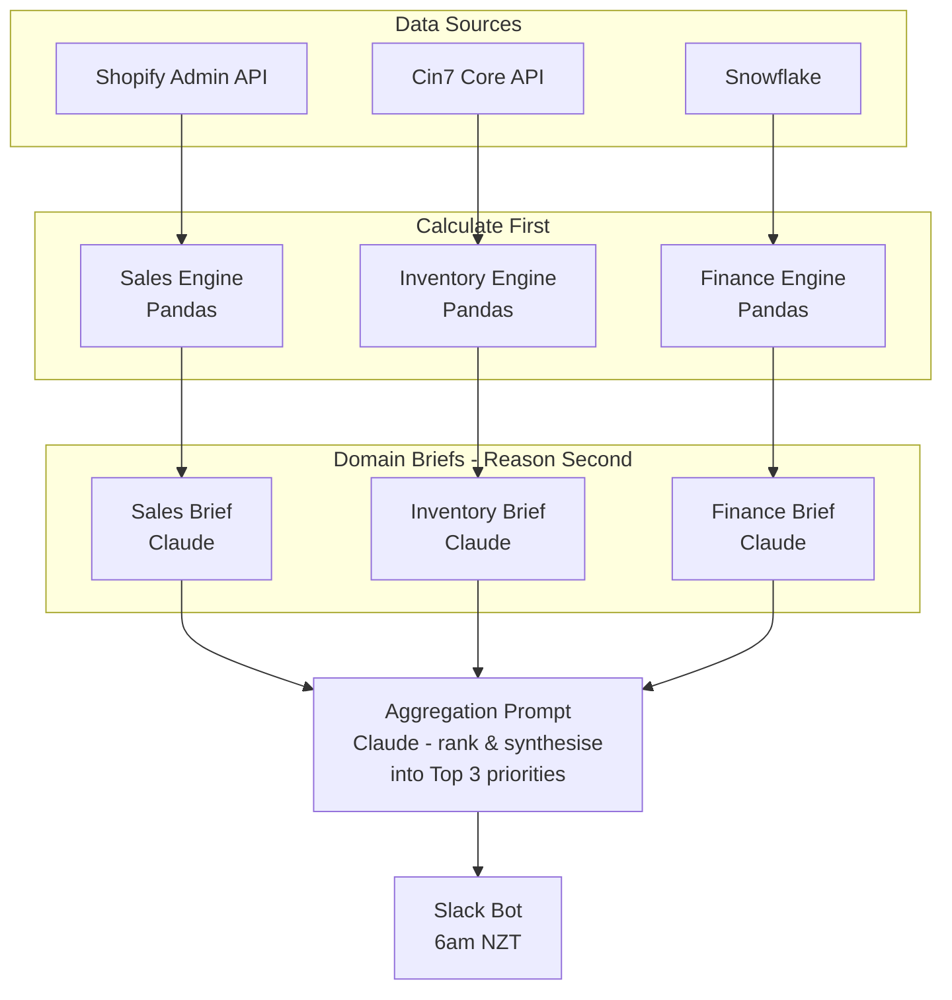

# Part 2: Morning Intelligence Brief

*How I'd build a daily automated message sent to the CEO at 6am NZT that surfaces the 3 most important things he needs
to know about the business that day.*

## Why Part 1 Is Already the Foundation

The S&OP system I built for Part 1 isn't a prototype - it's the first module of this system. The architecture (*
*calculate first, reason second**) was designed to be extended:

- **The Pandas engine** already ingests structured data, runs deterministic calculations, and outputs a clean JSON
  payload. Adding new data sources means adding new calculation modules that feed the same LLM pipeline.
- **The LLM service** already handles prompt management (Langfuse-versioned Jinja2 templates), retry logic (Tenacity),
  and observability (structured logging, OTLP tracing). The Morning Brief reuses all of this - it just gets a different
  prompt and a richer payload.
- **The prompt hardening process** (test on a weak local model, fix, add eval) transfers directly. Every new signal we
  surface gets a ground-truth validation test.

The Morning Brief is not a new system. It's a new prompt, new data connectors, and a scheduler bolted onto proven
infrastructure.

## Data Sources & What We'd Pull

### Shopify (Primary - Sales & Orders)

Via the [Shopify Admin API](https://shopify.dev/docs/api/admin-rest) (REST or GraphQL):

| Signal                            | API Endpoint              | Why It Matters                |
|-----------------------------------|---------------------------|-------------------------------|
| Yesterday's revenue (gross & net) | `Orders`                  | Daily P&L pulse               |
| Order count + AOV                 | `Orders`                  | Volume vs. value split        |
| Refund/return rate                | `Refunds`                 | Quality or fulfillment issues |
| Top-selling SKUs (24h)            | `Orders > line_items`     | Demand spikes to watch        |
| Discount code usage               | `Orders > discount_codes` | Promo effectiveness           |
| New vs. returning customers       | `Customers`               | Acquisition health            |

### Cin7 (Inventory & Fulfillment)

Via the [Cin7 Core API](https://api.cin7.com/):

| Signal                  | Why It Matters                             |
|-------------------------|--------------------------------------------|
| Stock levels by SKU     | Stockout risk - already modelled in Part 1 |
| Units shipped yesterday | Fulfillment velocity                       |
| Backorders              | Demand we can't fill                       |
| Inbound shipments (ETA) | Pipeline visibility for at-risk SKUs       |

This replaces the static CSV from Part 1 with live inventory data. The `sop_engine.py` calculations run identically -
they don't care where the DataFrame came from.

### Data Warehouse (Snowflake - Historical & Financial)

For signals that require joins across systems or historical context:

| Signal                              | Why It Matters                  |
|-------------------------------------|---------------------------------|
| Revenue vs. forecast (MTD)          | Are we tracking to plan?        |
| YoY comparison (same day last year) | Seasonality context             |
| CAC and ROAS by channel             | Marketing spend efficiency      |
| Gross margin by SKU                 | Profitability, not just revenue |
| Subscription churn/renewal rate     | Recurring revenue health        |

The warehouse is where Shopify + Cin7 + marketing spend data converge. A single SQL query can answer "are we profitable
on this SKU after ad spend" - something no single source can answer alone.

## Architecture

This is a **multi-stage LLM pipeline**, not a single monolithic prompt. Each domain gets its own calculation engine and
its own prompt - just like Part 1, but replicated per data source. Here's why:

1. **Each domain prompt stays small and testable.** A sales prompt that summarises yesterday's Shopify data is easy to
   eval. A 15-signal mega-prompt is not.
2. **Independent failure.** If Cin7 is down, the inventory brief is skipped - the sales and finance briefs still
   generate. A single prompt would fail entirely.
3. **Separate evals per domain.** The Part 1 eval pattern (ground truth from Pandas vs. LLM output) applies to each
   domain independently. The sales brief gets sales-specific evals, the inventory brief gets stockout evals.
4. **The aggregation prompt is the new skill.** It receives 3 structured domain summaries (not raw data) and ranks them.
   This is a much easier task for the LLM - it's synthesising pre-digested narratives, not reasoning across 15 raw
   metrics.

## The "Top 3" - LLM-Ranked Aggregation

The aggregation prompt receives the 3 domain briefs and produces the CEO's top 3:

> *"You are the CEO's chief of staff. Below are today's domain summaries from Sales, Inventory, and Finance. Select the
3 most important things the CEO needs to know today. Explain each in 2-3 sentences. Prioritise by: (1) immediate revenue
risk, (2) customer experience impact, (3) operational bottleneck. If a signal appears in multiple domains, synthesise it
into one story (e.g., 'refund spike + stockout on the same SKU' becomes a single priority, not two)."*

This is better than rule-based ranking because:

- Novel cross-domain patterns surface naturally - the LLM connects dots across summaries that rules would miss
- The CEO gets narrative, not a dashboard - "Here's what matters and why" in 60 seconds
- Priority weights evolve by updating the prompt, not rewriting code

The Part 1 eval approach applies at both levels: domain-level evals validate each brief against its data, and an
aggregation eval validates that the top 3 ranking matches human judgment on known scenarios.

## How the Report Shifts With More Data

Part 1's weekly S&OP brief covers inventory health. The Morning Brief is fundamentally different:

| Dimension      | Part 1 (Weekly S&OP)         | Part 2 (Morning Brief)                  |
|----------------|------------------------------|-----------------------------------------|
| Frequency      | Weekly                       | Daily                                   |
| Audience focus | Ops team - "what to reorder" | CEO - "what to worry about"             |
| Data depth     | 12 SKUs, 4 months history    | Cross-system, real-time                 |
| Output length  | Full briefing (~4 min read)  | 3 bullets (~60 sec read)                |
| Scope          | Inventory only               | Sales + inventory + marketing + finance |

With real-time Shopify data, the brief can catch things the weekly S&OP never could: a sudden refund spike, a viral SKU
selling out in hours, or a promo that's bleeding margin. The Cin7 integration means stockout alerts are live, not based
on 4-month-old momentum projections.

## Scheduling & Delivery

**Scheduler:** A cron-triggered Cloud Run job (or Fly.io Machine with `fly machine run --schedule`). Runs at 6am NZT
daily (`0 18 * * * UTC`).

**Delivery:** Slack via [Incoming Webhooks](https://api.slack.com/messaging/webhooks). Markdown renders natively in
Slack - the same `st.markdown()` formatting from Part 1 works here. The message includes a "View Full Dashboard" link
back to the Streamlit app for drill-down.

**Why Slack over email:** Terravita is a DTC brand with a small exec team. Slack is where decisions happen. A Slack
message gets read in 30 seconds; an email gets buried. If the CEO prefers email, the same markdown renders via SendGrid
in under 10 lines of code.

## Rough Cost

| Component                                                                | Monthly Cost            |
|--------------------------------------------------------------------------|-------------------------|
| Claude Sonnet API (~120 calls/month: 3 domain + 1 aggregation x 30 days) | ~$15                    |
| Shopify API                                                              | Free (included in plan) |
| Cin7 API                                                                 | Free (included in plan) |
| Snowflake (lightweight queries)                                          | ~$5-10                  |
| Fly.io (cron machine, ~1 min/day)                                        | ~$2                     |
| Slack webhook                                                            | Free                    |
| **Total**                                                                | **~$25-30/month**       |

This is trivially cheap. The value of one prevented stockout on a $80 product pays for years of this system.

## Failure Modes & Mitigations

| Failure                           | Impact                    | Mitigation                                                                                                                                                                  |
|-----------------------------------|---------------------------|-----------------------------------------------------------------------------------------------------------------------------------------------------------------------------|
| Shopify API rate limit / downtime | Missing sales data        | Tenacity retry with backoff (already built). If still down after 3 retries, send brief with available data + "Shopify data unavailable" flag.                               |
| Cin7 API timeout                  | Missing inventory data    | Same retry pattern. Fall back to last-known-good inventory snapshot cached in the warehouse.                                                                                |
| Claude API outage                 | No brief generated        | Retry with backoff. If all 3 attempts fail, send a raw-data fallback message: "AI brief unavailable - here are yesterday's key numbers" with the pre-computed metrics only. |
| Snowflake query timeout           | Missing financial context | Set 30s query timeout. Brief generates without financial signals - still useful with Shopify + Cin7 data alone.                                                             |
| Bad LLM output (hallucination)    | Misleading priorities     | Same eval framework from Part 1. Nightly eval run compares LLM ranking against rule-based baseline. Alert on divergence > threshold.                                        |
| Scheduler fails silently          | CEO gets nothing          | Dead man's switch: if Slack message isn't posted by 6:15am, a simple health check triggers an alert to the on-call channel.                                                 |

The system is designed to degrade gracefully - a partial brief with real data is always better than no brief at all.
